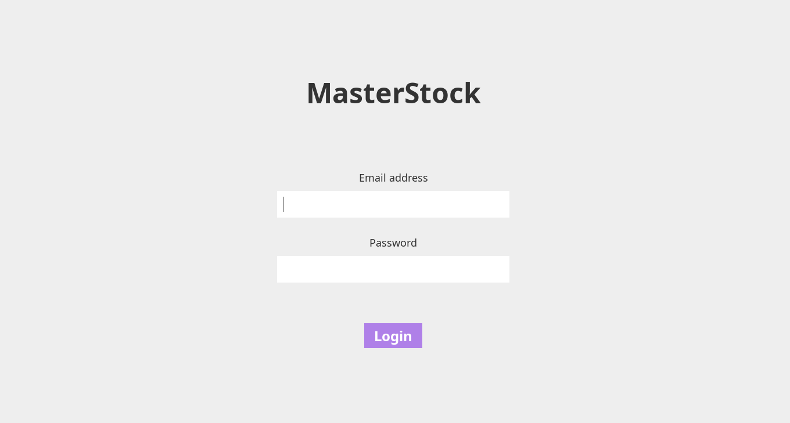
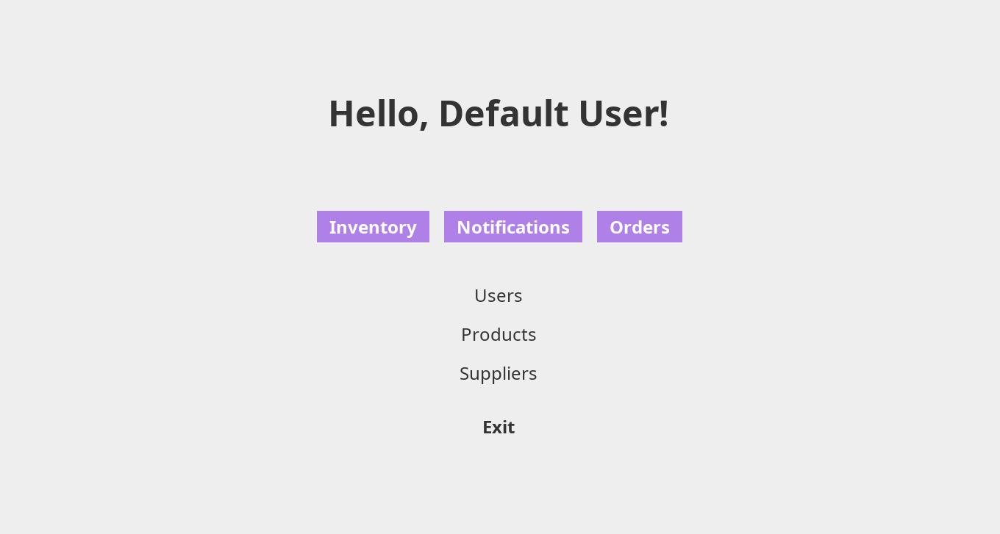
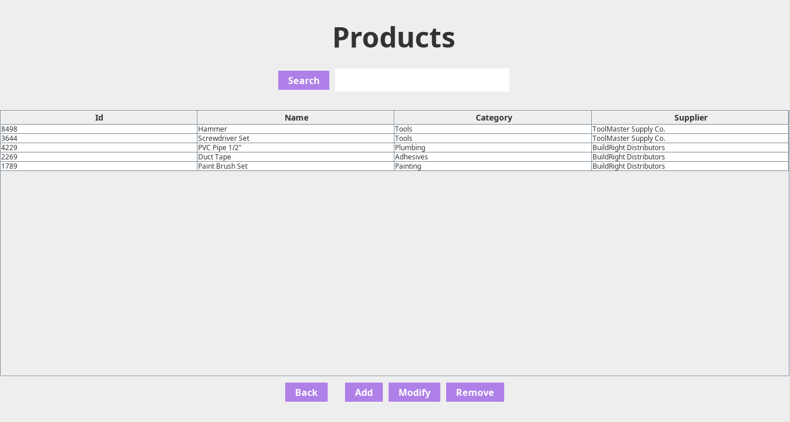
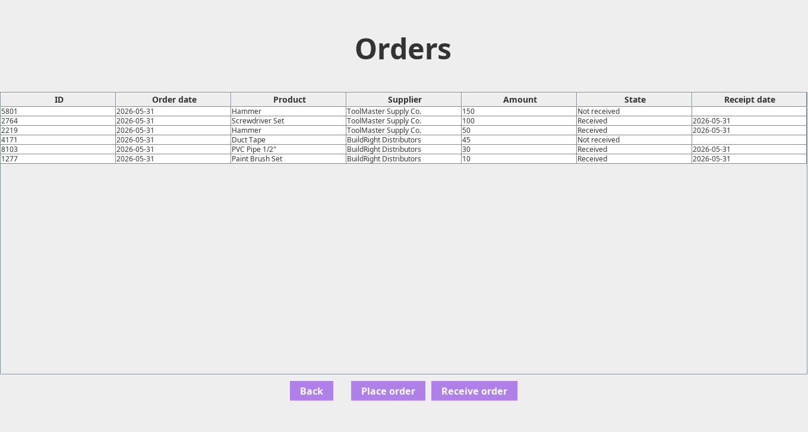

# 📦 MasterStock

A desktop inventory management application built in Java with a Swing UI. MasterStock allows users to manage products, suppliers, stock movements, purchase orders, and automated stock notifications from a single interface.

Built as a course project for **Object-Oriented Programming** at Universidad Tecnológica de Pereira.

---

## Screenshots

| Login | Dashboard |
|:---:|:---:|
|  |  |

| Inventory | Orders |
|:---:|:---:|
|  |  |

---

## Features

- **Product & supplier management**: Create, modify, and delete products and suppliers.
- **Stock movements**: Register purchases and sales; the inventory updates automatically.
- **Weighted average unit price**: The unit price is recalculated on every new purchase using the weighted average of all purchases for that product.
- **Purchase orders**: Track pending and received orders with reception dates.
- **Stock notifications**: Automatic alerts when a product's balance falls below its minimum or exceeds its maximum threshold.
- **CSV export**: Export the current inventory to a `.csv` file using a native file picker.
- **Role-based access**: User accounts with an Administrator role flag.

---

## Architecture

The application follows a **three-layer architecture**:

```
┌─────────────────────────────────────┐
│               View                  │  Swing UI (JFrame, JDialog)
├─────────────────────────────────────┤
│              Service                │  Business logic
├─────────────────────────────────────┤
│            Repository               │  In-memory data (ArrayList)
└─────────────────────────────────────┘
```

Each repository and service is implemented as a **Singleton**, ensuring a single shared instance across all views without passing dependencies manually through constructors.

### Data model

| Class | Responsibility |
|-------|---------------|
| `Product` | Product name, description, category |
| `Supplier` | Supplier contact information |
| `Inventory` | Balance, unit price, total price, min/max stock thresholds |
| `Movement` | Purchase or sale record with quantity and unit price |
| `Order` | Purchase order linked to a supplier, with received/pending state |
| `Notification` | Auto-generated alert for stock limit violations |
| `User` | Credentials and administrator role flag |

> **Note:** data is stored in memory and does not persist between sessions. Persistent storage (e.g. a relational database) is a natural next step for this project.

---

## Project Structure

```
src/
├── main/
│   └── Main.java               # Entry point
├── model/                      # Domain entities
│   ├── Product.java
│   ├── Supplier.java
│   ├── Inventory.java
│   ├── Movement.java
│   ├── Order.java
│   ├── Notification.java
│   └── User.java
├── repository/                 # In-memory CRUD (Singleton)
│   ├── ProductRepository.java
│   ├── SupplierRepository.java
│   ├── InventoryRepository.java
│   ├── MovementRepository.java
│   ├── OrderRepository.java
│   ├── NotificationRepository.java
│   └── UserRepository.java
├── service/                    # Business logic (Singleton)
│   ├── ProductService.java
│   ├── SupplierService.java
│   ├── InventoryService.java
│   ├── MovementService.java
│   ├── OrderService.java
│   ├── NotificationService.java
│   └── UserService.java
└── view/                       # Swing UI
    ├── LoginView.java
    ├── DashboardView.java
    └── ...
```

---

## Getting Started
 
### Requirements
 
- Java 11+
### Compile
At the root of the project:
 
```bash
javac -d bin */*.java */*/*.java
```
 
### Run
 
```bash
cd bin
java main.Main
```
 
A default administrator account is created on startup:
 
| Field | Value |
|-------|-------|
| Email | `user@user.com` |
| Password | `123` |
 
---
 
## Tech Stack
 
| | |
|---|---|
| Language | Java 11+ |
| UI | Java Swing |
| Data storage | In-memory (ArrayList) |
| Design patterns | Singleton, Three-layer architecture |